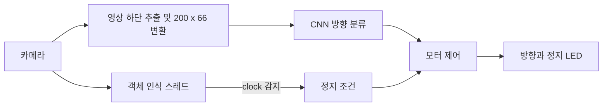

# 임베디드 자율주행 자동차

**직접 모은 주행 영상으로 CNN을 학습하고 Raspberry Pi 자동차의 실제 조향에 적용한 수업 프로젝트입니다.** 카메라로 실내 트랙을 보고 직진·좌회전·우회전을 선택하며, 시계 객체를 인식하면 정지하고 LED로 상태를 표시합니다.

2024년 2학기 · 임베디드응용 및 실습 · 기말보고서 제출 2024.12.17

Python · TensorFlow/Keras · OpenCV DNN · Raspberry Pi GPIO · threading

## 직접 수행한 작업

- 차량을 조종하면서 카메라 이미지와 조작 방향을 함께 수집했습니다.
- 우측 통행을 기준으로 시계·반시계 방향, 코너에서 차로를 찾아가는 상황을 데이터에 담았습니다.
- 교수님이 제공한 CNN 학습 코드를 Backend.AI에서 실행해 직접 수집한 데이터로 학습·재학습하고 차량에 적용했습니다.
- 주행·객체 인식·모터 정지와 방향별 LED 제어를 연결하고, 목표 객체의 표시 방식을 수정했습니다.

CNN 구조와 수업용 차량 라이브러리를 처음부터 독자 개발한 것으로 설명하지 않습니다.

## 동작 흐름

| 기능 | 보관 코드의 구현 |
|---|---|
| 방향 예측 | Keras 모델의 3개 출력 중 가장 높은 확률 선택 |
| 객체 인식 | 사전 학습 SSD MobileNet v2를 OpenCV DNN으로 호출 |
| 정지 조건 | `clock` 객체 인식 결과에 따라 모터 정지 |
| 병행 처리 | 객체 인식 스레드, 공유 카메라 프레임의 lock 사용 |
| 하드웨어 표시 | GPIO로 좌회전·우회전·정지 LED 제어 |

## 시행착오

**데이터 증가 후 성능 저하:** 최초 3,000장에 다른 장소의 2,000장을 추가해 재학습했지만 정확도가 낮아졌습니다. 학습 설정 변경도 초기 모델보다 좋은 결과로 이어지지 않았습니다. 데이터 양과 성능이 항상 같이 증가하지 않았던 사례입니다.

**정지 지연 개선:** 객체를 인식해도 늦게 멈추는 문제가 있어 처리 간격과 이미지 크기를 바꿔봤습니다. 이후 모든 객체에 표시하던 박스를 목표 객체인 `clock`에만 그리도록 수정한 뒤 반응이 개선됐다고 보고했습니다. 화면 표시 부담은 당시 추정한 원인이며 정량 지연 측정은 하지 않았습니다.

## 소스와 실행 조건

[src/drive.py](src/drive.py)는 **2024년 기말보고서에 수록한 코드를 복원한 파일**입니다. 빈 줄과 서식만 정리했고, 현재 시점에 새로운 제어 로직을 추가하지 않았습니다.

실행에는 당시 Raspberry Pi 차량과 카메라, GPIO 배선, 그리고 아래의 별도 자료가 필요합니다.

- 수업용 `SDcar` 모터 제어 라이브러리
- 학습한 `lane_navigation_*.h5` 파일
- `frozen_inference_graph.pb`, `ssd_mobilenet_v2_coco_2018_03_29.pbtxt`
- `object_detection_classes_coco.txt`

위 자료는 이 저장소에 포함되지 않습니다. 코드에 기재된 상대 경로와 모델 경로를 본인 환경에 맞춘 뒤 `src`에서 실행하는 구조입니다. [requirements.txt](requirements.txt)는 import 목록이며, 당시 Raspberry Pi 환경의 버전 잠금 파일은 아닙니다.

## 기록과 검증 범위

기말보고서의 설명·코드와 11주차·13주차 주행 영상을 근거로 정리했습니다. 코드 문법을 검사했으며, 현재 차량에서의 재실행과 성능 재측정은 수행하지 않았습니다. 보고서에 남은 모델 학습과 실제 하드웨어 적용 경험을 보관하는 저장소입니다.
