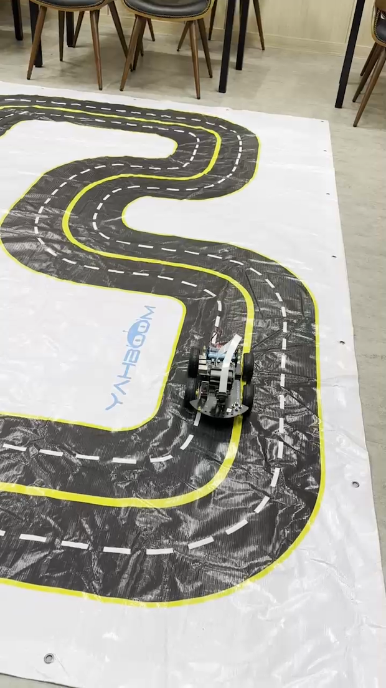
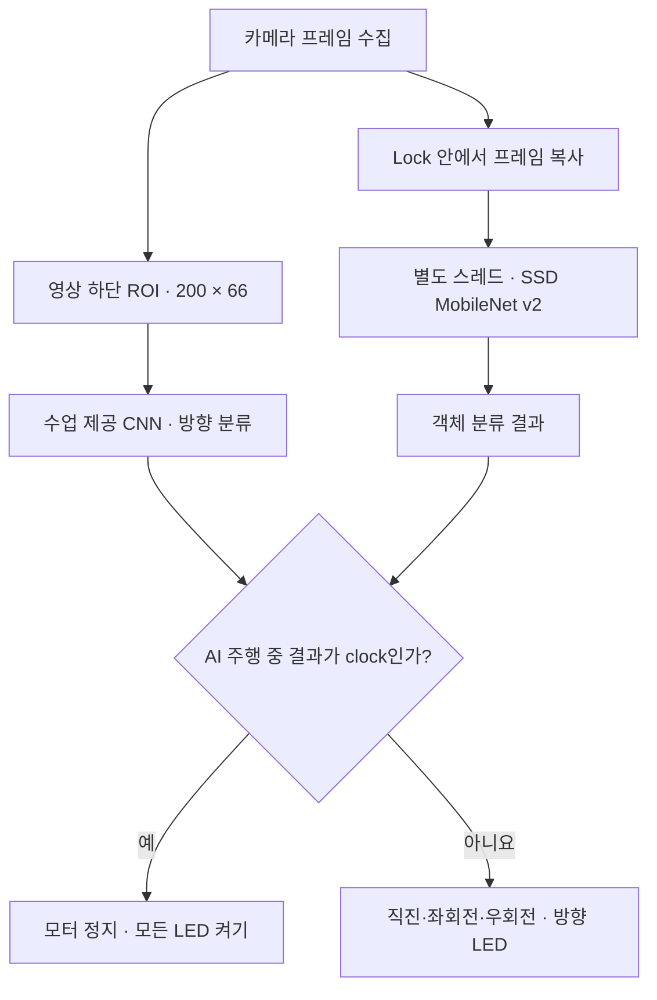

# 임베디드 자율주행 자동차

**직접 수집한 주행 이미지로 CNN을 학습하고, 카메라 영상에 따라 방향을 제어하며 시계 객체 앞에서 정지하도록 구현한 Raspberry Pi 자동차입니다.**

> 2024년 2학기 · 임베디드응용 및 실습 · 수업 프로젝트

## 프로젝트 개요

실내 트랙에서 차량을 직접 조종해 이미지와 방향 라벨을 모으고, 학습한 모델을 실제 차량의 주행에 적용했습니다.
주행 방향 예측과 객체 인식을 함께 수행하며, AI 주행 중 인식 결과가 `clock`이면 방향 명령보다 정지 분기를 먼저 실행합니다.

| 항목 | 내용 |
|---|---|
| 목표 | 카메라 기반 트랙 주행과 특정 객체 인식에 따른 정지 |
| 주행 판단 | CNN으로 직진·좌회전·우회전 3개 방향 분류 |
| 객체 인식 | 사전 학습된 SSD MobileNet v2를 OpenCV DNN으로 실행 |
| 직접 수행 | 주행 데이터 수집·모델 학습·주행 및 정지 동작 적용·표시 작업 수정 |
| 제공받은 기반 | 수업 제공 CNN 학습 코드와 차량 제어 환경 |

## 실제 주행 환경



*수업 당시 촬영한 실내 트랙과 차량입니다.*

## 목표와 핵심 동작

- **영상으로 방향 판단:** 도로가 보이는 카메라 영상의 하단을 잘라 `200 × 66` 크기로 전처리하고, CNN의 예측값으로 방향을 결정합니다.
- **객체 인식에 따른 정지:** 별도 스레드에서 객체 인식을 수행하고, AI 주행 중 시계 인식 결과에 따라 모터를 정지합니다.
- **동작 상태 표시:** 좌·우회전 시 해당 방향 LED를 켜고, 시계 인식에 따른 정지 시 모든 LED를 켭니다.
- **수동·AI 주행 전환:** 키보드로 차량을 조종하거나 AI 주행과 객체 인식을 각각 켜고 끌 수 있습니다.

## 동작 구조



카메라 프레임을 갱신하거나 객체 인식용으로 복사할 때 `threading.Lock`을 사용합니다.
객체 인식 추론은 복사한 프레임으로 수행하며, 주행 루프와 별도 스레드에서 동작합니다.

## 기술과 역할

| 기술 | 프로젝트에서의 역할 |
|---|---|
| Python | 주행 루프, 키 입력 처리, 객체 인식 스레드 |
| TensorFlow / Keras | 수업 제공 CNN 학습 및 학습 가중치 추론 |
| OpenCV / OpenCV DNN | 카메라 입력, ROI 전처리, SSD 객체 인식, 결과 표시 |
| Raspberry Pi / `SDcar` | 차량에서 코드 실행 및 모터 제어 |
| RPi.GPIO | 주행 방향과 정지 상태를 LED로 표시 |
| Backend.AI | 수집 데이터를 사용한 모델 학습 환경 |

## 개인 수행 내용

### 1. 직접 조종하며 주행 데이터 수집

트랙에서 직진·좌회전·우회전 키를 입력할 때 카메라 이미지와 방향을 함께 저장했습니다.
우측 통행을 기준으로 선의 위치와 트랙 밖 흰색 영역을 보며 조작해, 이미지와 방향 라벨이 일정한 기준을 갖도록 수집했습니다.

### 2. 수업 제공 CNN을 학습하고 차량에 적용

수집 데이터를 Backend.AI에서 학습하고, 저장한 Keras 모델을 차량에서 불러와 방향을 예측했습니다.
**CNN 구조와 학습 코드는 수업에서 제공받았으며, 직접 수행한 부분은 데이터 수집·학습 수행·차량 적용입니다.**
이 저장소에는 보고서에서 복원한 주행 코드가 있으며, 학습 코드와 가중치는 포함하지 않았습니다.

### 3. 주행·객체 인식·LED 동작 구성

객체 인식용 스레드에서 카메라 프레임을 복사해 추론하고, 주행 함수에서 그 결과를 확인하도록 구성했습니다.
정지 조건을 방향별 모터 명령보다 앞에 두고, 방향과 정지 상태를 LED로 확인할 수 있도록 했습니다.

## 문제 해결: 객체를 인식해도 정지가 늦는 현상

| 단계 | 내용 |
|---|---|
| 문제 | 주행과 객체 인식을 동시에 실행할 때 정지가 늦어 시계 객체와 충돌하는 경우가 있었습니다. |
| 조치 | 인식한 모든 객체에 박스와 이름을 그리던 부분을 수정해, 목표인 `clock`만 화면에 표시했습니다. |
| 확인 결과 | 수정 후 정지 반응이 개선되는 모습을 실습에서 관찰했고 기말 보고서에 기록했습니다. |

기말 보고서에는 처리 시간이나 정지 거리의 전후 측정값이 없습니다.
따라서 표시 작업이 지연의 유일한 원인이었다고 단정하지 않고, **표시 대상을 줄인 뒤 개선을 관찰한 사례**로 정리했습니다.

데이터 수집에서도 장소를 바꿔 이미지를 추가한 뒤 성능이 오히려 낮아지는 결과를 경험했습니다.
데이터 양뿐 아니라 촬영 조건과 방향 라벨의 일관성도 함께 살펴야 한다는 점을 배웠습니다.

## 저장소 구성

```text
embedded-autonomous-car/
├── README.md
├── requirements.txt       # 코드의 import를 기준으로 정리한 의존성
├── src/
│   └── drive.py           # 기말 보고서에서 복원한 주행 코드
└── docs/
    ├── SETUP.md           # 차량 환경과 별도 준비 파일
    └── images/
        └── track.png      # 실습 당시 트랙 사진
```

## 실행 조건

이 저장소는 **2024년 기말 보고서에 수록된 코드를 복원한 기록**입니다.
당시 실습에서는 차량으로 주행했지만, 복원한 코드를 현재 하드웨어에서 다시 실행하거나 성능을 재측정하지는 않았습니다.

실행에는 카메라와 모터·LED를 갖춘 Raspberry Pi 차량, 수업용 `SDcar` 라이브러리, CNN 주행 가중치, SSD 객체 인식 가중치·설정·클래스 목록이 별도로 필요합니다.
모델 파일 경로와 GPIO 배선은 실제 차량 환경에 맞춰야 하며, `requirements.txt`는 당시 버전 잠금 파일이 아닙니다.

준비 자료와 배치 조건은 **[실행 환경 안내](docs/SETUP.md)**에서 확인할 수 있습니다.
필요한 파일과 환경을 준비한 뒤 다음 위치에서 실행합니다.

```bash
cd src
python drive.py
```

| 키 | 동작 |
|---|---|
| `e` / `w` | AI 주행 활성화 / 비활성화 및 정지 |
| `t` / `r` | 객체 인식 활성화 / 비활성화 |
| `q` | 모터 정지 후 프로그램 종료 |

시계 인식에 따른 자동 정지는 AI 주행과 객체 인식을 모두 활성화했을 때의 동작입니다.
수동 방향 조작은 코드에 기록된 키 코드와 실행 환경의 키 입력값을 확인해야 합니다.

[주행 코드 보기](src/drive.py) · [실행 환경 안내](docs/SETUP.md)
